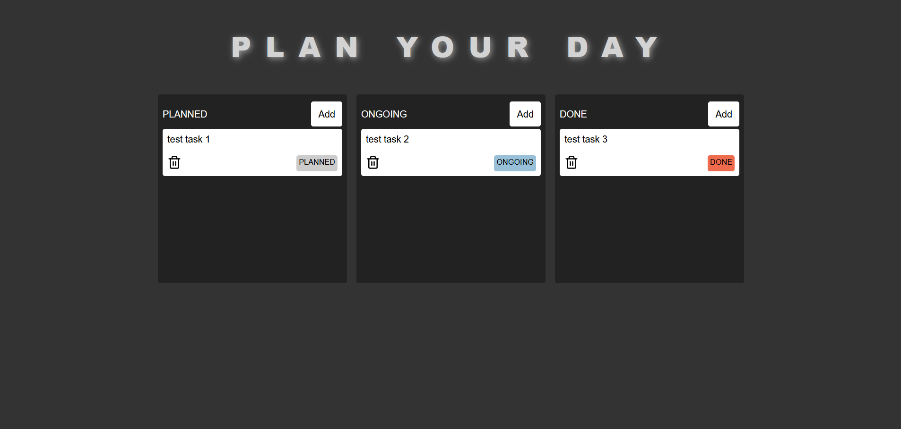

# ZUSTAND-TASKS

## Description

**Zustand Tasks** is a simple application created as a learning project for understanding the principles of Zustand state management in React. _Zustand Tasks_ enable you to efficiently categorize tasks according to their status. This straightforward organization method helps you stay in control of your daily responsibilities.

**Screenshots**

## Table of Contents

- [Features](#features)
- [Installation](#installation)

## Features

- **Task Creation** You can create tasks in any section, be it "Planned," "Ongoing," or "Done," based on your current priorities.
- **Task Deletion** Remove tasks from any section with a single click, helping you keep your task list clean and organized.
- **Task Movement** Seamlessly drag and drop tasks between sections, to categorize tasks based on their status, ensuring clear visibility and easy tracking.

## Installation

To get started with **Zustand Tasks** built with Vite, follow these simple steps:

1. **Clone the Repository**

   To get started, clone the Rental repository to your local machine using Git. Open your terminal or command prompt and run the following command:

   `git clone https://github.com/illaan/playground-tasks-zustand.git`

2. **Navigate to the Projcet Directoriey**

After cloning the repository, you'll need to navigate to the project directoriy. Here's how to do it:

`cd zustand-tasks`

3. **Install dependencies**

Inside project directory, you'll need to install the project dependencies:

In the zustand-tasks directory:
`npm install`

4. **Start the Development Server**

In the zustand-tasks directory, start the server with the following command:
`npm run dev`

5. **Access the App**

Open your web browser and access the app at [http://localhost:5173](http://localhost:5173)

You're now ready to efficiently manage your tasks with Zustand state management in your Vite-based application. Enjoy the seamless task organization provided by the app!
